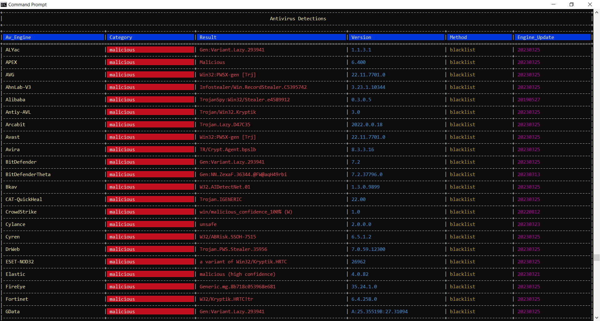
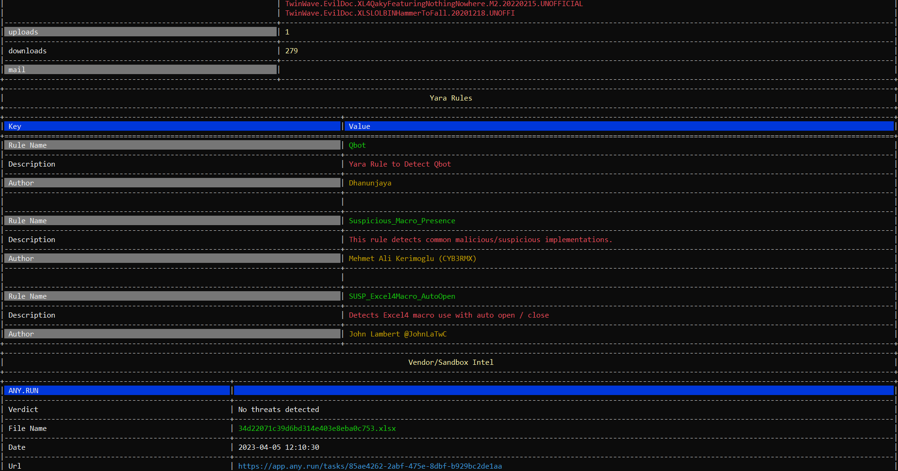

# PE_Potato


PE Potato is a PE/ELF binary analyzer that allows cyber security professionals such as threat hunters, reverse engineers, malware analysts, etc, to communicate with malware databases and sandboxes. This allows professionals to gather threat intelligence information about malware characteristics, behaviour, Mitre Attack techniques, detection/response mitigations, etc.


PE Potato gathers threat intelligence from the following platforms:
- Virus Total
- Malware Bazaar
- ANY.RUN
- CERT PL MWDB
- Yoroi Yomi
- VxCube
- InQuest
- DocGuard
- Triage
- Reversing Labs
- Spamhaus HBL
- FileScan IO
- Intezer
- UnpackMe
- VMRay

If you are someone who does not care about threat intelligence and you just want to verify if a file is malicious, PE Potato has you covered.

Using the Virus Total client, users can create queries about malicious files by supplying a file hash or a file path.




## Features
- View exported functions
- View imported functions
- View libraries
- View sections
- View the DOS header
- View the file header
- View the COFF header
- View Directories
- Query Virus Total for:
  - General information
  - Sections
  - AV Detections
  - Binary Names
  - Imports
  - Exports
  - Compiler Products
  - Yara Rules
  - Tags
  - HTTP Conversations
  - IP Traffic
  - Contained Resources
  - Contained Resources By Type
- Query Virus Total via:
  - Generated Hash
  - Manually Entered Hash
- Query Malware Bazaar via:
  - Hash (MD5, SHA1, SHA256)
  - File type
  - Tag
  - Signature
  - YARA rules
  - Sandbox intel
- Display raw Malware Bazaar json responses

## Planned features
- A modern GUI
- Elf parsing support
- View strings
- View debug info
- View the manifest
- View version info
- Query Virus Total for:
  - Basic Propeties
  - History
  - Pe Header
  - Contained Resources By Language
  - Mitre Attack TTP's
  - DNS lookups
  - Sigma Rules
  - Written and dropped files
  - Set registry keys
  - Process Tree
  - Other malicious payload information
- Upload samples to Virus Total
- Malware Bazaar:
  - Download individual samples
  - Download samples in bulk
  - Generate file hashes from disk
  - Recent malware samples (100 most recent samples or samples added in the last hour)

## Configuration
PE Potato can be configured to use the Virus Total and Malware Bazaar APIs.
Utilizing Virus Total and Malware Bazaar each requires an API key.

Enabling features can be done by changing values from `false` to `true` and by inserting API keys into the configuration file.
For those who feel uncomfortable directly storing API keys in the configuration file, bash-style environment variables are supported and can be used across all platforms.

There is a bug in the Malware Bazaar API by abuse.ch that allows users to query the malware database without an API. As this may be fixed in the future, PE Potato will require an API in a future update.
Example configuration:
```json
{
  "vt_enable_search": true,
  "vt_api_key": "$MY_VIRUS_TOTAL_API_KEY",
  "mb_enable_search": true,
  "mb_enable_download": false,
  "mb_api_key": "$MALWARE_BAZAAR_API_KEY"
}
```

## Installing Rust
1. Following the instructions on [rustlang.org](https://www.rust-lang.org/tools/install)
2. Download and install rustup
3. Verify cargo is correctly installed with
```bash
cargo -V
```

## Building PE Potato
1. Git clone PE Potato
2. Cd into the root project directory
3. Enter the following command
```bash
cargo build --release
```

You find the compiled binary in `/target/release/`